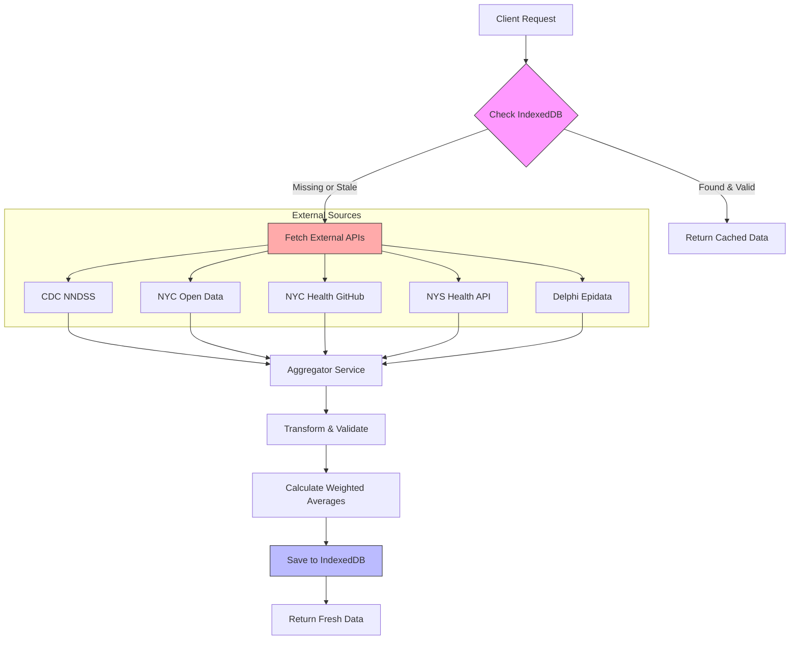

# NYC/NYS Public Health Dashboard - Design Documentation

## 1. Project Purpose & Intent
The NYC/NYS Public Health Dashboard is a centralized visualization tool designed to provide public health officials and physicians with critical, up-to-date health metrics for New York City and New York State.

**Key Goals:**
- **Consolidation**: Aggregates data from disparate federal (CDC), state (NYS), and city (NYC) sources into a single view.
- **Clarity**: Translates raw data (codes, CSVs) into physician-friendly formats (e.g., mapping "4313314" to "Combined 7-Vaccine Series").
- **Accuracy**: Implements rigorous data methodology (weighted averages, seasonal aggregation) to address reporting anomalies.
- **Performance**: Uses local caching and optimized build strategies to ensure instant load times for mobile/desktop users.

## 2. Architecture & Tech Stack
- **Frontend**: React 19 + TypeScript (Vite)
- **State Management**: React `useState` / `useEffect` with Service-based data fetching.
- **Storage**: IndexedDB (via `idb-keyval`) for persistent client-side caching.
- **Styling**: Vanilla CSS for maximum control and lightweight bundle.
- **Visualization**: Custom inline progress bars and simple trend indicators.

## 3. Data Sources
The dashboard aggregates data from 5 distinct sources:

| Category | Dataset | Source | API / format |
|----------|---------|--------|--------------|
| **Diseases** | **Generic Diseases** (Measles, Mpox, etc.) | CDC NNDSS | [Socrata API](https://data.cdc.gov/resource/x9gk-5huc.json) |
| **Diseases** | **COVID-19 Cases** | NYC Open Data | [Socrata API](https://data.cityofnewyork.us/resource/rc75-m7u3.json) |
| **Diseases** | **Influenza (ILI)** | Delphi Epidata (CMU) | `https://api.delphi.cmu.edu/epidata/fluview/` |
| **Vaccines** | **Childhood Series** (DTaP, Polio, etc.) | NYC Health (GitHub) | [CSV](https://raw.githubusercontent.com/nychealth/immunization-data/main/demo/Main_Routine_Vaccine_Demo.csv) |
| **Vaccines** | **Seasonal Respiratory** (COVID/Flu doses) | NYS Health Data | [Socrata API](https://health.data.ny.gov/resource/xrhr-cy84.json) |

## 4. Data Methodology & Logic

### 4.1 Vaccination Coverage (Childhood)
**Problem**: Raw vaccinated counts (`COUNT_PEOPLE_VAC`) sometimes exceed population estimates (`POP_DENOMINATOR`) in specific demographic groups due to migration or census estimation errors (e.g., >100% coverage).
**Solution**: 
- We use the **pre-validated `PERC_VAC` column** from the source data, which is capped and validated by NYC DOH.
- The Overall Rate is calculated as a **Weighted Average**:
  $$ \text{Rate} = \frac{\sum (\text{PERC\_VAC} \times \text{POP\_DENOMINATOR})}{\sum \text{POP\_DENOMINATOR}} $$
- This ensures the aggregate rate matches official reports (e.g., Polio ~87.2% vs ~94% raw).

### 4.2 Seasonal Doses (COVID/Flu)
**Problem**: The NYS API returns weekly data, and `geography_level=STATE` often returns empty results.
**Solution**:
- We query with `geography_level=REST OF STATE`.
- We **aggregate** all weekly `dose_count` records for the current respiratory season (e.g., "2024-2025") to display a "Season Total".
- Large numbers are formatted compactly (e.g., "1.2M doses") to fit UI constraints.

### 4.3 Disease Trends
- **Trends**: Calculated by comparing current week vs previous periods.
- **Visuals**: 📈 (Increasing >2 cases), 📉 (Decreasing >2 cases), ➡️ (Stable).

## 5. Storage & Persistence
**Decision**: Client-side **IndexedDB** (via `idb-keyval`).

- **Why IndexedDB?**: Larger storage quota than LocalStorage, async I/O prevents UI blocking.
- **Cache Strategy**: 
  - **Stale-while-revalidate**: Check cache first.
  - **Daily Refresh**: Data expires at **10:00 AM local time** (common release time for health data).
  - **Metadata**: Stores `lastFetched` and `expiresAt` timestamps.

### Data Fetching Flow



## 6. Build Optimization
**Decision**: Manual Code Splitting in Vite.

- **Problem**: Large dependencies (`react-dom`, `recharts`) caused >500kB warning.
- **Solution**: Configured `manualChunks` in `vite.config.ts` to split:
  - `vendor-react`: React core libraries.
  - `vendor-ui`: Recharts and Framer Motion.

## 7. Directory Structure
```
src/
├── components/      # UI Components (VaccinationPanel, Header, etc.)
├── services/        # Business Logic & API
│   ├── api.ts              # General API utils
│   ├── cache.ts            # IndexedDB wrapper
│   ├── diseaseService.ts   # Disease data fetching & processing
│   └── vaccinationService.ts # Vaccine logic (Weighted Avg, Mapping)
├── types/           # TypeScript Interfaces
└── Documentation/   # Project Documentation
```
