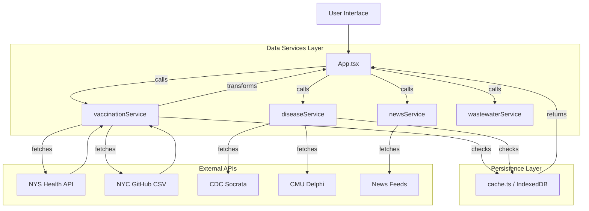
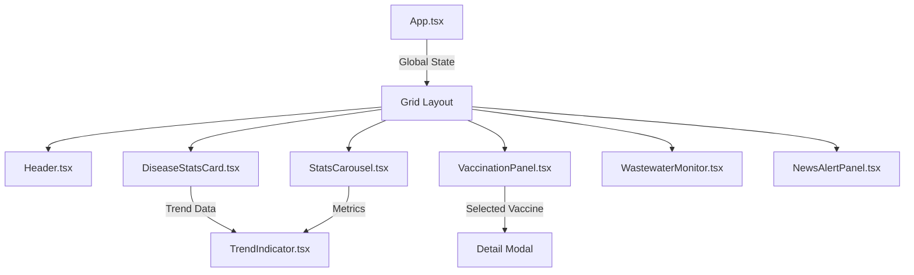
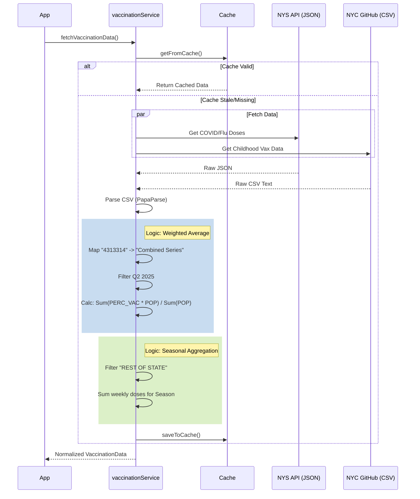

# Implementation Details & Code Structure

This document provides a comprehensive technical overview of the NYC/NYS Public Health Dashboard codebase, explaining the directory structure, component relationships, data flow, and intent behind key modules.

## 1. Code Structure Tree

```text
src/
├── main.tsx                    # Entry point (React DOM render)
├── App.tsx                     # Main Application Controller (State & Layout)
├── App.css                     # Global Layout Styles
├── index.css                   # Global Resets & Variables
│
├── components/                 # Presentation & UI Logic
│   ├── Header.tsx              # Application Header & Navigation
│   ├── VaccinationPanel.tsx    # [COMPLEX] Main Vaccination Data Visualization
│   ├── DiseaseStatsCard.tsx    # Generic Card for Disease Metrics
│   ├── WastewaterMonitor.tsx   # Wastewater Surveillance Graph/Panel
│   ├── NewsAlertPanel.tsx      # Health News Ticker/List
│   ├── StatsCarousel.tsx       # Rotating Vital Stats
│   ├── TrendIndicator.tsx      # Reusable Trend UI (📈/📉)
│   ├── LoadingSpinner.tsx      # UI Loading State
│   └── *.css                   # Component-specific Isolation Styles
│
├── services/                   # Business Logic & Data Layer
│   ├── vaccinationService.ts   # [CORE] Vaccine Data Aggregation & Logic
│   ├── diseaseService.ts       # [CORE] Multiple Disease API Aggregator
│   ├── newsService.ts          # Health News Fetching
│   ├── wastewaterService.ts    # Wastewater Data Processing
│   ├── cache.ts                # [CORE] IndexedDB Persistence Layer
│   ├── api.ts                  # Shared Fetch Utilities
│   └── VaccineDataService.js   # (Legacy/Deprecated) - Keep for reference
│
├── types/
│   └── index.ts                # Shared TypeScript Interfaces (VaccinationType, DiseaseStats, etc.)
│
└── data/                       # Static Data / Assets
```

## 2. Code Graph & Data Flow

High-level data flow architecture:



## 2.1 Detailed Logic Flows

### High-Level Component Hierarchy

How data props flow down from the main App controller to specific visualizations:



### Vaccination Logic Flow (Implementation Level)

How `vaccinationService.ts` transforms raw CSV/JSON into the final UI state:



## 3. Module Intent & Implementation

### 3.1. Core Application (`App.tsx`)
- **Intent**: Acts as the central controller. It manages the global state for `vaccinationData`, `diseaseStats`, etc., and orchestrates the initial data fetching via `useEffect`.
- **Logic**: 
  - Triggers concurrent fetches on mount.
  - Manages loading states.
  - Composes the layout (Header -> Grid Layout -> Panels).

### 3.2. Data Services

#### `vaccinationService.ts`
- **Intent**: The most complex service. It unifies disparate data formats (CSV vs JSON) and granularities (City vs State).
- **Key Logic**:
  - **Normalization**: Maps specific vaccine codes (e.g., `4313314`) to readable names via `VACCINE_NAME_MAP`.
  - **Calculation**: Implements **Weighted Average** logic for childhood vaccines using `PERC_VAC` and `POP_DENOMINATOR`.
  - **Aggregation**: Sums weekly dose counts for COVID/Flu from NYS API to create seasonal totals.
  - **Caching**: Wraps all calls with `cache.ts` logic.

#### `diseaseService.ts`
- **Intent**: Provides a unified interface for "Disease Stats" regardless of source.
- **Logic**:
  - Fetches from CDC NNDSS (General), NYC Open Data (COVID), and Delphi (Flu).
  - Prioritizes NYC-specific data sources over generic CDC state data when available.
  - Normalizes trends (week-over-week changes).

#### `cache.ts`
- **Intent**: Performance optimization and resilience.
- **Logic**:
  - Uses `idb-keyval` for IndexedDB storage.
  - Implements **Time-Based Expiration** (expires at 10:00 AM daily).
  - Returns `CachedData<T>` including metadata (`lastFetched`).

### 3.3. UI Components

#### `VaccinationPanel.tsx`
- **Intent**: Visualize complex vaccination coverage data.
- **Structure**:
  - **Table Layout**: Fixed headers with scrollable body.
  - **Visuals**: Function `getComplianceColor` determines bar colors.
  - **Interactivity**: Click handlers on rows open the **Detail Modal**.
  - **Responsiveness**: Conditional rendering of columns based on available data years.

#### `WastewaterMonitor.tsx`
- **Intent**: Show early-warning signals.
- **Implementation**: Uses `recharts` to render line charts of viral load over time.

## 4. Design Decisions

1.  **Client-Side Aggregation**: We aggregate data on the client (browser) rather than a backend.
    *   *Reason*: Keeps hosting simple (static site), reduces cost, and leverages user device power.
2.  **Weighted Average vs. Raw Sum**:
    *   *Decision*: We calculate rates using `sum(perc * pop) / sum(pop)` instead of `sum(vac) / sum(pop)`.
    *   *Reason*: Raw vaccinated counts are noisy and often exceed population estimates in transient demographics. Source percentages are pre-validated.
3.  **Manual Chunking**:
    *   *Decision*: Split `react` and `recharts` vendors in `vite.config.ts`.
    *   *Reason*: Fast initial load; graph libraries are heavy and only needed for specific panels.
