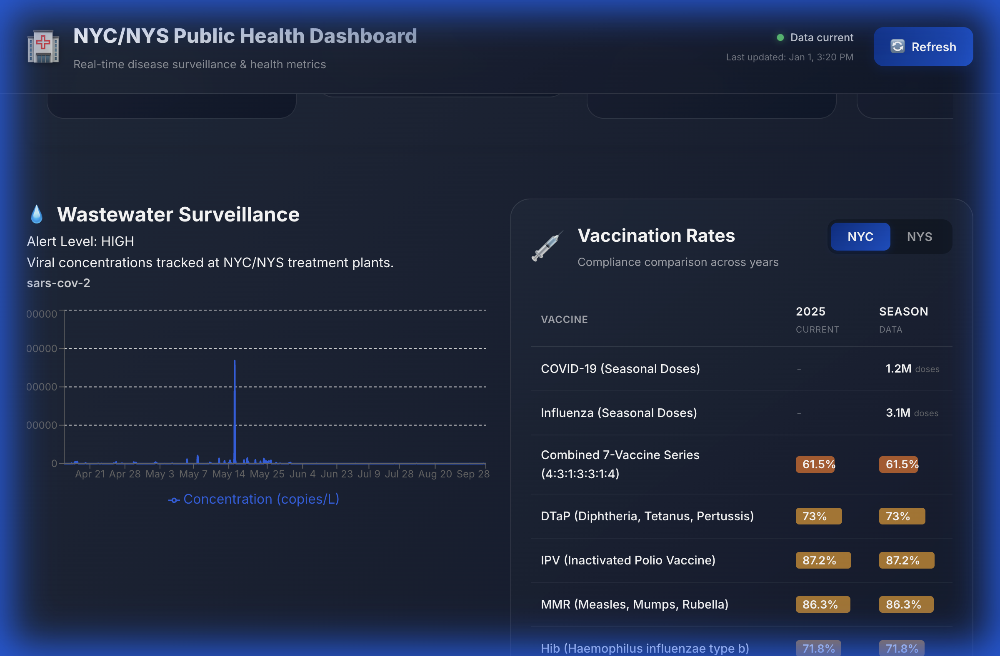

# NY Health Dashboard

A React + TypeScript + Vite application for monitoring New York health data.

## Getting Started

### Installation

```bash
npm install
```

### Development

Start the development server with Hot Module Replacement (HMR):

```bash
npm run dev
```

### Production (Live)

There are two ways to run the application in a production-like environment:

#### 1. Preview Mode (Vite)
Build the application and serve it locally on port 8080:

```bash
npm run live
```

#### 2. Process Manager (PM2)
Run the application using PM2 as configured in `ecosystem.config.cjs`:

```bash
npm start
```

## Additional Commands

- `npm run build`: Build the application for production.
- `npm run preview`: Serve the built application (default Vite preview).
- `npm run lint`: Run ESLint to check for code quality issues.

## Single Page Application (SPA)

A lightweight version of the dashboard that runs as a standalone SPA without React or a build step. It fetches real-time public health data directly from official sources.

### Running the SPA

1. Navigate to the SPA directory:
   ```bash
   cd SPA
   ```

2. Serve the directory using any HTTP server:
   ```bash
   # Using Python 3
   python3 -m http.server 8080
   
   # Or using Node's serve
   npx serve .
   ```

3. Open your browser to `http://localhost:8080`

## Data Visualization Components


*Dashboard Overview: Top-left 'Vaccination Status' showing coverage rates with inline progress bars; Top-right 'Wastewater Surveillance' graph; Bottom 'News & Alerts' ticker.*

### Vaccination Panel

The Vaccination Panel uses several visualization techniques:

- **Inline Progress Bars (Horizontal Bar Charts)**: Percentage-based vaccine coverage rates are displayed with color-coded horizontal bars that fill proportionally to the rate (0-100%).
  - Appears in **"2025 Current"** column for childhood vaccines
  - Appears in **"Season Data"** column for childhood vaccines (showing same coverage rate)
  - Colors indicate compliance levels:
    - 🟢 Green (≥90%): Excellent compliance
    - 🟠 Amber (70-89%): Good compliance  
    - 🟠 Orange (50-69%): Fair compliance
    - 🔴 Red (<50%): Low compliance

- **Compact Dose Counts**: Large numbers (like seasonal COVID/Flu doses) are formatted compactly (e.g., **"1.2M doses"**) to fit column layouts without overflow. These appear in the "Season Data" column for NYS respiratory vaccines.

### Data sources & Methodology

- **NYC Childhood Vaccines** (Combined Series, DTaP, IPV, MMR, Hib, HepB, Varicella, PCV): 
  - Source: NYC Citywide Immunization Registry (CIR) via GitHub CSV
  - **Target Population**: Children aged **24-35 months** (2 years of age by their second birthday)
  - **Population Denominators**: Based on NYC Health Department Vintage estimates derived from U.S. Census Bureau and NYC Department of City Planning data. These are statistical estimates and may contain decimal values.
  - **Methodology**: Rates are calculated as a **weighted average** of the pre-validated `PERC_VAC` column from source data, weighted by population.

- **HPV Vaccine**:
  - Source: NYC Citywide Immunization Registry (CIR) via GitHub CSV
  - **Target Population**: Adolescents aged **13-17 years** (series completion rates)
  - **Methodology**: Same weighted average approach as childhood vaccines.

- **NYS COVID-19/Influenza**: 
  - Source: NY State Immunization Information System (NYSIIS) via API
  - **Target Population**: All ages (NYS Rest of State geography)
  - **Methodology**: Aggregates total dose counts for the current respiratory season (e.g., 2024-2025).

## Full Stack Development
### Running Locally

To run the complete full-stack application (React Frontend + Node.js Backend):

1. **Install Dependencies**:
   ```bash
   npm install
   ```

2. **Start Backend & Frontend**:
   You need two terminal windows:

   **Terminal 1 (Backend)**:
   ```bash
   npm run dev:server
   ```
   *Runs on port 3001 by default.*

   **Terminal 2 (Frontend)**:
   ```bash
   npm run dev
   ```
   *Runs on port 5173 by default (proxies /api requests to 3001).*

### Running on a Remote Server (VPS)

If you are developing on a remote VPS (e.g., AWS EC2, DigitalOcean) and want to view the app on your local machine:

#### 1. Start the App on Remote Server
Follow the "Running Locally" steps above on your VPS. Ensure the backend is running on `3001` and frontend on `5173` (or `3000`).

#### 2. SSH Port Forwarding
From your **local machine**, create an SSH tunnel to forward the ports. This is more secure than opening firewall ports.

```bash
# Syntax: ssh -L [LocalPort]:localhost:[RemotePort] user@remote-ip

# Forward both Frontend (5173) and Backend (3001) ports
ssh -L 5173:localhost:5173 -L 3001:localhost:3001 user@your-vps-ip
```

*Replace `user@your-vps-ip` with your actual SSH credentials.*

#### 3. Access in Browser
Open your local browser and visit:
- **Frontend**: `http://localhost:5173`
- **Backend API**: `http://localhost:3001/api/status`

The app will work exactly as if it were running locally on your machine.

---

## Technical Implementation

- **Backend**: Node.js + Express with SQLite storage.
- **Frontend**: React + Vite (communicates with backend via REST & WebSocket).
- **Data Sync**: 
  - **Scheduled**: 10 AM daily automated refresh.
  - **Manual**: Trigger via API (rate-limited to 3/hour per IP).
  - **Caching**: Intelligent CSV caching with ETag support to minimize external bandwidth.
- **Real-time**: WebSocket connection for live sync status updates.
- **Build Optimization**: Vendor libraries (`react`, `recharts`, `framer-motion`) are split into separate chunks to ensure optimal bundle size and loading speed.
